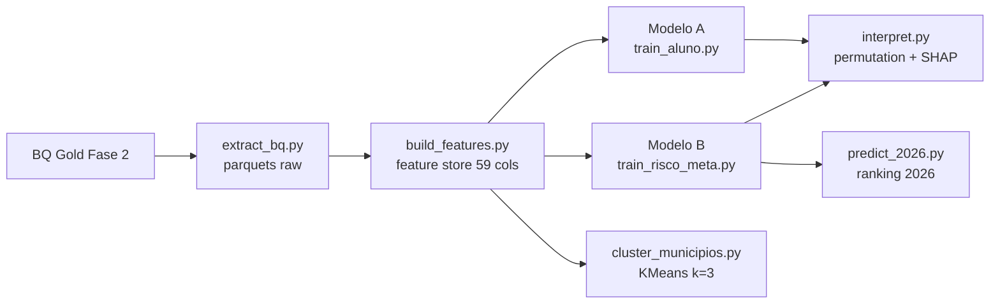

# Tech Challenge — Fase 3: Modelagem Preditiva da Alfabetização (SAEB/ANEB 2025)

> Pós-graduação FIAP — IAST. Continuação da Fase 2 (pipeline de dados Gold no
> BigQuery). Este repositório contém os **modelos de machine learning** sobre a
> base municipal da Fase 2.

## Contexto

A Fase 2 consolidou uma base **Gold municipal** (5.500 municípios) com resultados
de alfabetização 2023–2025, metas 2024–2030, Censo Escolar 2024 e enriquecimento
socioeconômico (IBGE, ADH). A Fase 3 responde: **é possível prever o risco de um
município não atingir suas metas de alfabetização e priorizar ações?**

## Objetivo analítico

Três produtos sobre a mesma feature store municipal:

| Produto | Grão | Target | Pergunta de negócio |
|---------|------|--------|---------------------|
| **Modelo A** | aluno (1,94M presentes) | `in_alfabetizado` | score de **risco contextual** de não alfabetização |
| **Modelo B** | município (5,4k) | `atingiu_meta_2025` | prever **não atingimento** de meta (backtest 2025 → projeção 2026) |
| **Clusters** | município | — | segmentar perfis educacionais/socioeconômicos |

## Base utilizada

- Gold da Fase 2 (BigQuery `semiotic-primer-366516.gold_ml.features_municipio`) +
  microdados AEEB 2025 (alunos presentes, `IN_PRESENCA_LP=1`).
- Enriquecimento: população IBGE 2024, PIB 2023, ADH/IDHM 2010, diretórios BD.
- **Anti-leakage (D4):** features só usam informação disponível **antes** da
  avaliação 2025. Proficiência ≥ 743 ⇔ alfabetizado é leakage determinístico
  (evidência em `reports/evidencia_leakage_proficiencia.md`) — nunca entra em X.

## Etapas de modelagem



Pré-processamento **dentro do Pipeline** (aprende só no fit de treino):
imputação por mediana (num) / moda (cat), `symlog1p` em contagens de cauda
longa, `StandardScaler`, `OneHotEncoder(handle_unknown="ignore")`.

## Escolha do algoritmo

| Candidato | Modelo A (AUC CV) | Modelo B (AUC CV) |
|-----------|------------------:|------------------:|
| Dummy | 0,500 | 0,500 |
| **LogReg** | 0,652 | **0,817** ✅ |
| HistGB | **0,660** ✅ | 0,799 |
| LGBM | 0,659 | 0,798 |
| RandomForest | 0,659 | 0,805 |

- **Modelo A → HistGB** (margem ≤0,01 sobre os demais — o limite é informacional,
  não a classe de modelo; ver G12). Hiperparâmetros via `RandomizedSearchCV`.
- **Modelo B → LogReg** — base pequena (5,4k) + sinal essencialmente linear
  (esforço/resultado). Vence os boosts sem tuning.

## Métricas

| Métrica | Modelo A (aluno) | Modelo B (meta) |
|---------|-----------------:|----------------:|
| ROC-AUC holdout | 0,666 | **0,852** |
| ROC-AUC GroupKFold (município novo) | 0,647 | — |
| PR-AUC (classe de risco) | 0,484 | 0,704 |
| Brier | 0,229 | 0,133 |
| ECE (calibração) | 0,147 ⚠️ | **0,018** |
| Threshold custo 5:1 (D9) | 0,727 → recall_risco 97% | 0,814 → recall_risco 87% |
| Ablação sem histórico (D13) | — | 0,790 |

- **Modelo A** é um **score de risco contextual**, não classificador individual:
  ICC municipal ≈ 0,081 → só ~8% da variância individual está entre municípios.
  Agregado ao município (n≥30 alunos), a média de probabilidade correlaciona
  **0,886** com a taxa observada. ECE 0,147 (`class_weight=balanced` subestima
  P(alfabetizado)) → usar para **ordenar**, não como frequência absoluta.
- **Modelo B** é calibrado de fábrica (ECE 0,018) → probabilidades legíveis como
  frequências; viram ranking de prioridade de gestão.

## Interpretação

Permutation importance (holdout) + SHAP `LinearExplainer` no Modelo B
(`reports/interpretabilidade.md`):

- **Modelo B top:** `esforco_t` (0,31), `total_mat_fund_ai` (0,20), `sg_uf` (0,15),
  `resultado_t1` (0,06). SHAP confirma: esforço exigido e porte da rede dominam.
- **Modelo A top:** `pc_alfabetizado_2024` (0,036), `sg_uf`, `tp_dependencia`,
  `ambicao_2030` — tudo **contexto municipal**, como esperado pelo ICC baixo.

## Insights — as 5 perguntas do enunciado

**1. Quais fatores mais impactam a alfabetização?**
O resultado histórico do município (`pc_alfabetizado_2024`, top-1 do Modelo A) e
o contexto socioeconômico/estrutural. A ablação D13 mostra que o contexto
**sozinho** (sem histórico) ainda entrega AUC 0,79 no Modelo B — sinal real, não
só inércia. Nenhuma feature individual de aluno é acessível (escola anonimizada).

**2. Quais municípios apresentam maior risco educacional?**
`reports/ranking_risco_2026.csv` (5.500 municípios ordenados por
`p_nao_atingir_2026`). O top-100 tem **88 municípios do RS** — sinal real: o RS
teve a pior taxa de atingimento 2025 do país (27,9% vs 72,5% nacional) e esforço
2026 médio de +10,5 p.p. (Brasil: −3,4). Risco médio de quem falhou 2025 = 0,67
vs 0,14 de quem atingiu.

**3. Quais regiões possuem padrões semelhantes?**
`reports/clusters_municipios.csv` — KMeans **k=3** (silhouette 0,219), fit sem
metas/2025/UF. Perfis: (0) *alto desempenho urbano pequeno* — pc2024 72%, S/SE;
(1) *alto desempenho urbano médio* — pc2024 62%, capitais/médios; (2) *baixo
desempenho rural pequeno* — pc2024 54%, 71% escolas rurais, PIB pc R$14,9 mil,
concentrado no **NE** (1.535 de 2.057). Validação externa: cluster 2 atinge 77,8%
das metas (metas menos ambiciosas), cluster 1 só 61,9%.

**4. Como prever municípios que podem não atingir metas futuras?**
Modelo B formulado genericamente em `t`: treina com backtest 2025 e projeta 2026
deslocando as features (`resultado_t1`, `meta_t`, `esforco_t`). AUC holdout 0,852,
ECE 0,018. Spearman(risco 2026, esforço 2026) = 0,784 — coerente.

**5. Quais variáveis possuem maior influência nos modelos?**
Consolidado em `reports/interpretabilidade.md`: **B** → `esforco_t`,
`total_mat_fund_ai`, `resultado_t1`, `total_doc_fund_ai`, `delta_t1`;
**A** → `pc_alfabetizado_2024`, `sg_uf`, `tp_dependencia`, `ambicao_2030`.

## Limitações

- **F1:** proficiência/respostas são leakage determinístico — excluídas por desenho.
- **F4:** `ID_ESCOLA` anonimizado → aluno só tem contexto municipal (Modelo A é
  contextual, teto de AUC baixo por construção, ICC≈0,08).
- **ADH/IDHM de 2010** (proxy estrutural, D2); VA setorial só até 2021.
- **Sem 2026 real:** a projeção 2026 é um deslocamento de features, não observado.
- **Modelo A não calibrado** (ECE 0,147) — usar para ordenação, não frequência.
- **Escopo reduzido (D14):** SHAP do Modelo A, mapas/UMAP e recalibração ficaram
  como evolução futura por restrição de prazo.

## Aplicação para políticas públicas

- **Ranking Top-50** (`ranking_risco_2026.csv`): priorizar os municípios de maior
  `p_nao_atingir_2026` para ações intensivas de alfabetização.
- **Clusters**: o cluster 2 (rural, NE, baixo desempenho) concentra o desafio
  estrutural — políticas de infraestrutura e formação docente; o cluster 1 (médios
  urbanos) é onde as metas são mais ambiciosas (atinge só 61,9%).
- **Score do Modelo A**: estimar a fração de crianças em risco por município para
  dimensionar vagas de reforço (agregado municipal, não triagem individual).

## Evoluções futuras

SHAP no Modelo A (HistGB), recalibração isotônica do Modelo A, mapas/UMAP dos
clusters, modelo hierárquico (município dentro de UF), features de escola se a
anonimização for revertida, monitoramento com o SAEB 2026 real.

## Como reproduzir

```powershell
# Python 3.11, GCP ADC configurado (projeto semiotic-primer-366516)
python -m venv .venv; .\.venv\Scripts\Activate.ps1
pip install -r requirements.txt

# Pipeline fim a fim (extract → features → Modelo B → ranking → clusters → interpret)
python run_all.py            # ~5 min; Modelo A (33 min) fica de fora por padrão
python run_all.py --with-aluno   # inclui o Modelo A completo

# Testes
.\.venv\Scripts\python.exe -m pytest tests -q   # 125 testes
```

`run_all.py` é idempotente (cache de parquets). Modelos `.joblib` são gitignored
e regenerados pelo pipeline.

## Estrutura

```
src/
  config.py              # paths, GCP project, SEED=42
  data/                  # extract_bq.py, build_features.py
  preprocessing/         # leakage.py, transformers.py, splits.py
  modeling/              # train_aluno.py, train_risco_meta.py, predict_2026.py,
                         # cluster_municipios.py
  evaluation/            # metrics.py, interpret.py
  visualization/         # plots.py
tests/                   # 125 testes (leakage, features, pipeline, métricas, modelos)
docs/                    # decisoes_analiticas.md (D1–D14)
reports/                 # EDA, resultados A/B, ranking 2026, clusters, interpretabilidade
```

## Equipe

Icaro Luis — [github.com/icaroluis4/tech-challenge-fase3](https://github.com/icaroluis4/tech-challenge-fase3)
